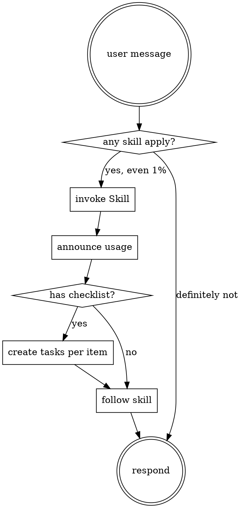

# SkillDiscipline

Check for skills before any response, including clarifying questions. If there is even a one-in-a-hundred chance a skill applies, invoke the Skill tool first.

## The Rule

Before responding to a user message:

1. Identify what the user is asking for — including clarifying questions, exploration, or apparently trivial answers.
2. Ask "does any skill match this intent?" If plausibly yes, invoke the Skill tool before drafting a reply.
3. Announce which skill you're using and why.
4. Follow the skill as written. If the skill has a checklist, convert each item into a task before proceeding.

## Flow

## Red Flags

These thoughts mean STOP — you are rationalizing your way out of a skill check:

| Thought                                 | Reality                                                   |
| --------------------------------------- | --------------------------------------------------------- |
| "This is just a simple question"        | Questions are tasks. Check for skills.                    |
| "I need more context first"             | Skill check comes BEFORE clarifying questions.            |
| "Let me explore the codebase first"     | Skills tell you HOW to explore. Check first.              |
| "I can check git or files quickly"      | Files lack conversation context. Check for skills.        |
| "Let me gather information first"       | Skills tell you HOW to gather information.                |
| "This doesn't need a formal skill"      | If a skill exists, use it.                                |
| "I remember this skill"                 | Skills evolve. Read the current version.                  |
| "This doesn't count as a task"          | Action is a task. Check for skills.                       |
| "The skill is overkill"                 | Simple tasks become complex. Use it.                      |
| "I'll just do this one thing first"     | Check before doing anything.                              |
| "This feels productive"                 | Undisciplined action wastes time. Skills prevent this.    |

## Priority When Multiple Skills Apply

1. **Process skills first** — brainstorming, debugging, planning. These decide HOW to approach the task.
2. **Implementation skills second** — domain-specific skills. These guide execution.

"Let's build X" → process skill (brainstorming), then implementation.
"Fix this bug" → process skill (debugging), then domain-specific.

## Skill Types

- **Rigid** (for example, test-driven development, debugging flows) — follow exactly. Do not adapt away discipline.
- **Flexible** (patterns) — adapt principles to context.

The skill itself tells you which kind it is.

## Constraints

- Skill check precedes the first token of any response, including clarifying questions
- User instructions say WHAT, not HOW; a direct instruction does not authorize skipping a workflow
- If the Skill tool finds nothing that plausibly matches, proceed directly to the response — do not invent a skill
